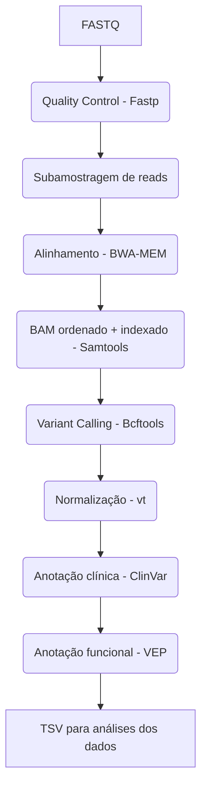

# Pipeline de Anotação de Variante (NGS)

Pipeline reprodutível para controle de qualidade, alinhamento, chamada de variante e anotação de variantes a partir de dados de sequenciamento NGS, implementado em ambiente Docker.

🎯 **Objetivos**
- Garantir reprodutibilidade por meio de containerização
- Executar um workflow completo de FASTQ → VCF anotado
- Aprendizado de alinhamento de sequência, chamada de variante e anotação de variante

🧰 **Tecnologias Utilizadas**  
**Bioinformática**
- Fastp – controle de qualidade e filtragem de reads
- BWA-MEM – alinhamento ao genoma de referência
- Samtools – manipulação, ordenação e indexação de BAM
- Bcftools – chamada e anotação de variantes
- vt – decomposição e normalização de variantes
- Ensembl VEP – predição de impacto funcional

**Análise de dados**
Python (Em andamento)

**Infraestrutura**
Docker + Miniconda para portabilidade e consistência de versões

🧬 **Referência Genômica**
- Montagem: GRCh38
- Para fins didáticos e otimização de recursos, foi utilizado apenas o cromossomo 20
- O FASTA foi indexado com: samtools faidx e bwa index

📊 **Visão Geral do Workflow**

